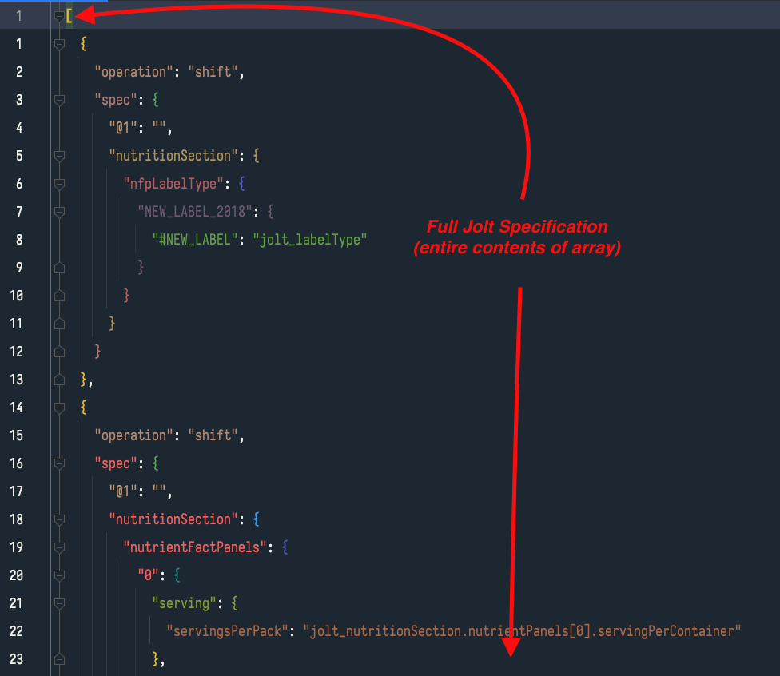
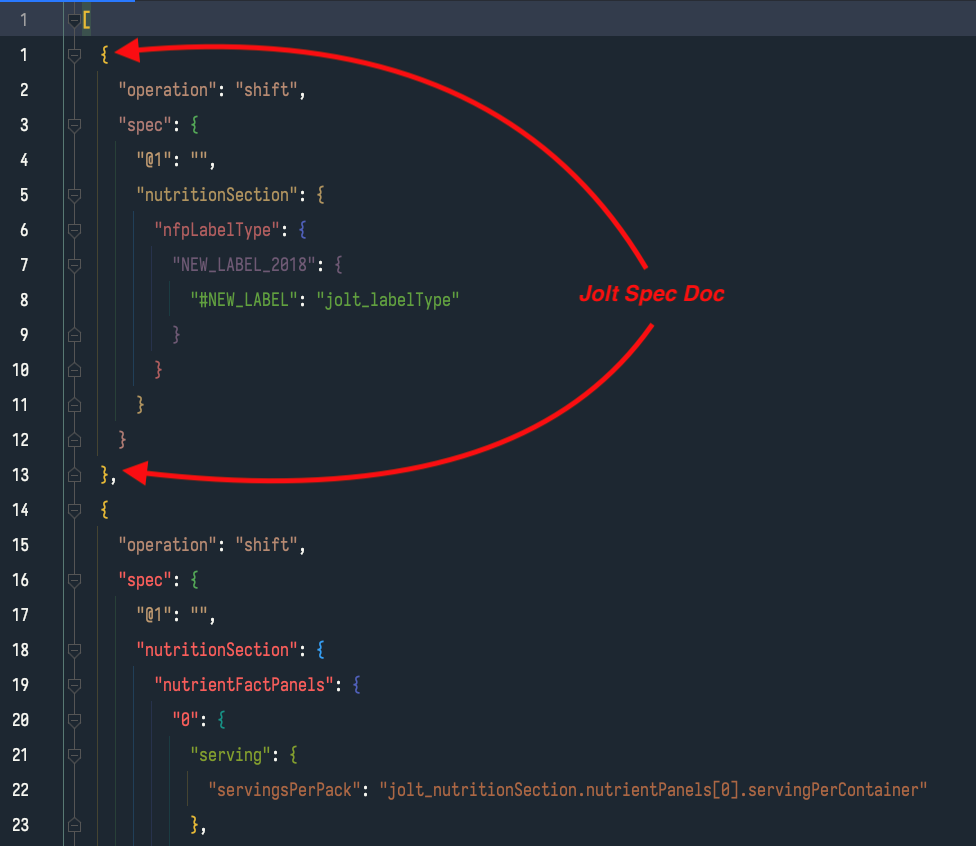

# spec-builder-client

## Overview

The jolt-builder-client (or jolt spec builder or whatever I land on for a name :|) is a tool that facilitates the building of jolt specs by abstracting the jolt
language behind clearly named UI elements and focusing in on the parts of jolt spec objects that we really need to
edit. <come back and clarify this explanation>

## Terms

### Jolt Doc Array

The contents of the array that makes up all of the jolt steps.



### Jolt Document (joltDoc)

The entire contents of a single jolt step.



### Jolt Spec

The contents of the `spec` property in a jolt doc.


## Concepts

### Disabled Blocks

#### The TL;DR of how disabling blocks work in this app:

- Disabling blocks is currently only for front end tool to allow you to build and debug jolts
- Disabled blocks are removed from the jolt when transforming it back to the full jolt document array
- comments are allowed in jolt docs and doc arrays, but the jolt builder will rip them out, so if you really want them in, add them after converting from ui
  blocks to the jolt doc array

#### The details

The Block view includes the concept of disabling blocks to exclude them from transformation runs. The intention is to help with debugging a jolt as you work
through it in the tool, but it is not meant as a way of serializing and persisting disabled code.

An interesting aspect of the jolt chainr run is that it can deserialize json with comments in it and run it, so if you have a jolt document array with comments
in it, as long as the json structure is otherwise valid and the jolt docs are valid jolt docs, it will run. So you _can_ save specs with comments in them on the
server side.

This is great, but the javascript client can't handle the json comments when serializing and deserializing. We pulled in
the [JSON5](https://github.com/json5/json5) library which helps with handling comments when transforming the json, but at the moment, the library handles it by
stripping the comments out. It doesn't blow up the stringify or parse, but the comments don't make it through and at the
moment [there is no support for perserving the comments](https://github.com/json5/json5/issues/201).

Another interesting aspect of jolt is that when the server deserializes jolt documents it ignores any properties that it doesn't explicitly expect, which is why
we can add properties like `renderComponent` to the document without the chainr transformation blowing up. Technically we _could_ add a disabled property to the
document, adjust the server code to recognize the property and use it to ignore steps, but I'm trying to avoid this. My goal is to make the jolt's valid so that
a vanilla jolt installation could process the transformation without any additional tooling; the jolt builder is for building jolts, not an extended jolt
processor. This isn't to say that custom transforms couldn't be added to the server, just that we want these docs to run through "jolt" and not "li-jolt".

## Objectives

### MVP

- [x] translate an existing jolt document into a data structure that can be represented in customizable UI blocks
- [x] translate the customizable UI blocks back into valid jolt syntax
- [x] submit data for transformation on blur of UI components
- [ ] Delete blocks
- [ ] Reorder blocks
- [ ] Disable/enable blocks
- [ ] validate jolt built from UI blocks
- [~] create UI blocks that represent each of the stock jolt operations with tools that make understanding and building those blocks easier
- [ ] allow for reordering of blocks
- [ ] allow for disabling of blocks
- [x] given an example input structure, quickly run transformations with given UI blocks and immediately show output object
- [ ] add tooling and UI hints for jolt specific symbols to give the user a hint of what the symbol would be referring to in the example input
- [ ] create domain specific transformations as stock blocks

### Passed MVP

- [ ] Load jolt docs directly from database
- [ ] Save jolt docs as new versions in database
- [ ] pull an example product from the database to use by product id
- [ ] create side by side comparison layout for input and output
- [ ] conditionally include blocks based on a configuration object (the idea julie had)
- [ ] pull the menu buttons out to a list, move them into the domain/operations/... directories, and make their population dynamic so that the button's presence
  is dependent on the domain operation pieces being there.

## Project setup

```
npm install
```

### Compiles and hot-reloads for development

```
npm run serve
```

### Compiles and minifies for production

```
npm run build
```

### Run your unit tests

```
npm run test:unit
```

### Lints and fixes files

```
npm run lint
```

### Customize configuration

See [Configuration Reference](https://cli.vuejs.org/config/).
