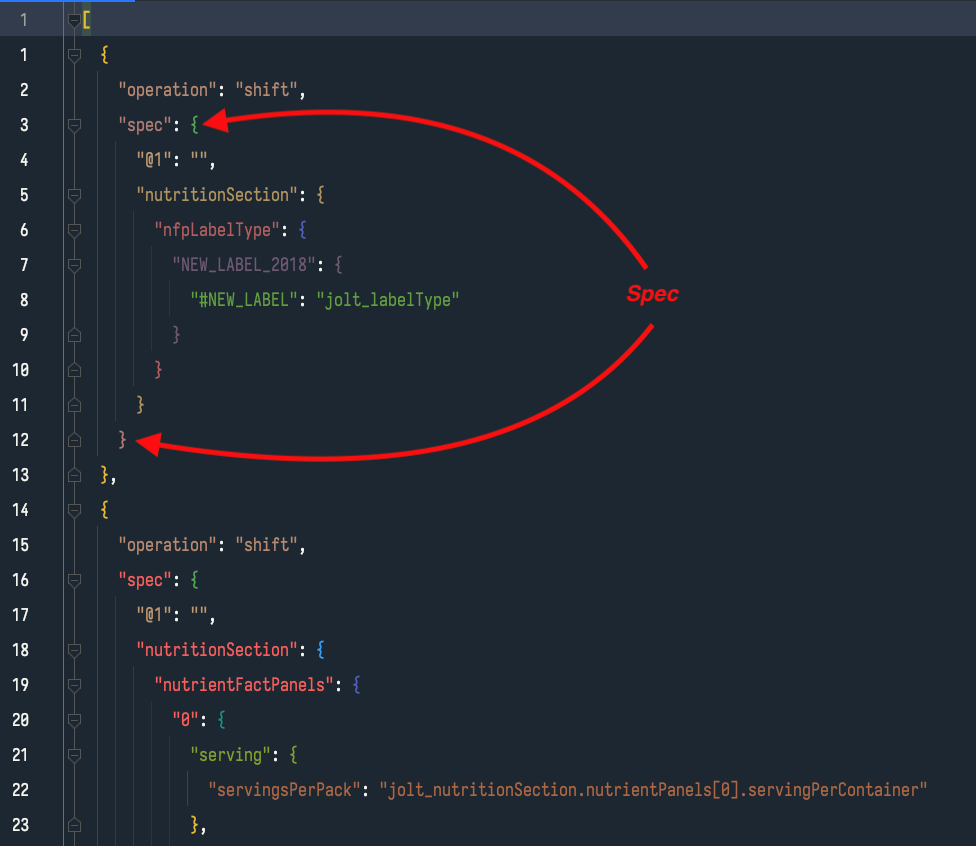

# spec-builder-client

## Preamble

This codebase is a prototype upgraded from a proof of concept and therefore is full of duplication, lack of abstraction, and hacky shit. I started this project
thinking it would just be a thin idea and didn't concern myself with structure or unit tests and by the time it ballooned into something bigger I was
facepalming for not putting in that up-front thinking.

As I went I tried to make it easy to add in tests and refactor, but yeah, in some ways it's a hot mess. That said, it's a functional hot mess that can either be
cleaned up or at least can inform a proper rebuild sooooo there's that.

## Overview

The jolt-builder-client (or jolt spec builder or whatever I land on for a name :|) is a tool that facilitates the building of jolt specs by abstracting the jolt
language behind clearly named UI elements and focusing in on the parts of jolt spec objects that we really need to edit.

The thought behind it is that part of what makes building jolt transformations difficult is that you need to KNOW jolt to use it and jolt is a really cumbersome
and non-obvious concept to try to wrap your brain around. Also, when creating a transformation "knowing jolt" isn't the problem to solve; transforming the
product is the problem to solve and knowing jolt is just implementation necessity. With this mindset, what if we could remove the need to know jolt from using
it. If we abstract the logic for formatting a valid jolt document array behind UI tooling that's focused on understandability then we can let the end user worry
about transforming the product and let the bits and boops do the pedantic work of formatting the transformations with the correct
only-the-computer-needs-to-know-about-these artifacts to make a valid jolt.

### Focusing on the actual problem to solve

Sometimes this is just a light abstraction to allow the user to focus on the part of the jolt that's the actual concern like a shift operation:


_the only thing we really care about in a shift operation is the spec property itself_


_as opposed to the full shift jolt which contains a lot of extra artifacts_

Sometimes it's a heavy abstraction to simplify a complex task for a user like rekey-ing a property:


_if the concept is "rename one of these properties", then we can heavily abstract the task_


_and in the background the client can handle any of the actual formatting needs to make it a valid jolt operation_

### Seeing live results

<fill in with concept>

## Terms

### Jolt Doc Array

The contents of the array that makes up all of the jolt steps.


### Jolt Document (joltDoc)

The entire contents of a single jolt step.


### Jolt Spec

The contents of the `spec` property in a jolt doc.



## Concepts

### Disabled Blocks

#### The TL;DR of how disabling blocks work in this app:

- Disabling blocks is currently only for front end tool to allow you to build and debug jolts
- Disabled blocks are removed from the jolt when transforming it back to the full jolt document array
- comments are allowed in jolt docs and doc arrays, but the jolt builder will rip them out, so if you really want them in, add them after converting from ui
  blocks to the jolt doc array

#### The details

The Block view includes the concept of disabling blocks to exclude them from transformation runs. The intention is to help with debugging a jolt as you work
through it in the tool, but it is not meant as a way of serializing and persisting disabled code.

An interesting aspect of the jolt chainr run is that it can deserialize json with comments in it and run it, so if you have a jolt document array with comments
in it, as long as the json structure is otherwise valid and the jolt docs are valid jolt docs, it will run. So you _can_ save specs with comments in them on the
server side.

This is great, but the javascript client can't handle the json comments when serializing and deserializing. We pulled in
the [JSON5](https://github.com/json5/json5) library which helps with handling comments when transforming the json, but at the moment, the library handles it by
stripping the comments out. It doesn't blow up the stringify or parse, but the comments don't make it through and at the
moment [there is no support for perserving the comments](https://github.com/json5/json5/issues/201).

Another interesting aspect of jolt is that when the server deserializes jolt documents it ignores any properties that it doesn't explicitly expect, which is why
we can add properties like `renderComponent` to the document without the chainr transformation blowing up. Technically we _could_ add a disabled property to the
document, adjust the server code to recognize the property and use it to ignore steps, but I'm trying to avoid this. My goal is to make the jolt's valid so that
a vanilla jolt installation could process the transformation without any additional tooling; the jolt builder is for building jolts, not an extended jolt
processor. This isn't to say that custom transforms couldn't be added to the server, just that we want these docs to run through "jolt" and not "li-jolt".

## Objectives

### MVP

- [x] translate an existing jolt document into a data structure that can be represented in customizable UI blocks
- [x] translate the customizable UI blocks back into valid jolt syntax
- [x] submit data for transformation on blur of UI components
- [x] Delete blocks
- [x] Disable/enable blocks
- [~] validate jolt built from UI blocks
- [~] create UI blocks that represent each of the stock jolt operations with tools that make understanding and building those blocks easier
- [ ] allow for reordering of blocks
- [x] given an example input structure, quickly run transformations with given UI blocks and immediately show output object
- [ ] add tooling and UI hints for jolt specific symbols to give the user a hint of what the symbol would be referring to in the example input
- [x] create domain specific transformations as stock blocks

### Passed MVP

- [ ] Load jolt docs directly from database
- [ ] Save jolt docs as new versions in database
- [ ] pull an example product from the database to use by product id
- [ ] create side by side comparison layout for input and output
- [ ] conditionally include blocks based on a configuration object (the idea julie had)
- [ ] pull the menu buttons out to a list, move them into the domain/operations/... directories, and make their population dynamic so that the button's presence
  is dependent on the domain operation pieces being there.

## Project setup

```
npm install
```

### Compiles and hot-reloads for development

```
npm run serve
```

### Compiles and minifies for production

```
npm run build
```

### Run your unit tests

```
npm run test:unit
```

### Lints and fixes files

```
npm run lint
```

### Customize configuration

See [Configuration Reference](https://cli.vuejs.org/config/).

# Creating a new Operation

## Create a new `domain/operations` or `domain/li-operations` folder

As an attempt at combatting the business logic spread and possibly moving to a more plugin-style structure I'm storing all of the logic for operations in
a `domain` folder (for a lack of better name).

The intention of the `operations` folder is to house generic operations; i.e. the logic in this folder should apply to any kind of jolt doc.

The `shift` operation is a good example, shift is just a generic "rekey the values at the end of this json structure to something else". This also included more
specialized but still general operations like the `rekey-property` operation which does the same thing as a shift operation but can only operate on ONE property
within the input data and is heavily abstracted in the UI.

The intention of the `li-operations` folder is to hold operations that are specific to Label Insight. Operations in this folder should be seen as specific
pre-defined transformations of our product model that are needed frequently.

E.g. the `smartlabel-nutrition` operation is very specific to LI usage and would only be used in certain circumstances.

### Required files

The domain operations folders consist of:

- BlockMenuItem.ts: <add desc>
- DefaultJoltDoc: <add desc>
- Vue component file: <add desc>
- UiBlock.ts: <add desc>
- Transformer.ts: <add desc>

## Add cases to TransformationUtilities

TransformationUtilities routes requests to convert ui blocks to jolt operations and vice versa. Theoretically/hopefully we could make this more dynamic to allow
us to pull in the needed logic automatically, but for now you need to add case statements and function calls to the conversion methods.

## Add enum and case to UiBlockUtilities

UiBlockUtilities contains an enum that's used across the codebase to refer to UI Blocks that should be used to render the operations along with a function used
to determine which vue component to use based on the enum value. Any new component needs to be referenced here.

## Add new RenderData to UiBlockOperations BlockRenderData type

The RenderData interfaces define the shape of data ancillary data used to render the UI Blocks. Because we're typescripting we need to add any new RenderData
interfaces to a generic BlockRenderData type.